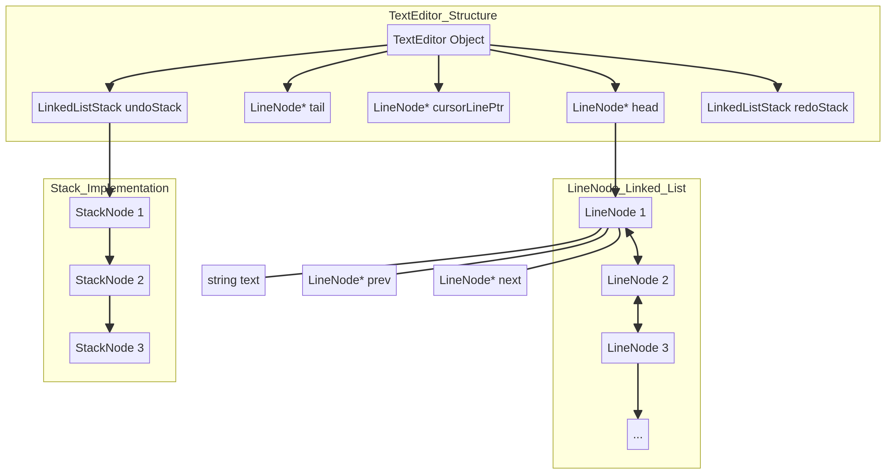
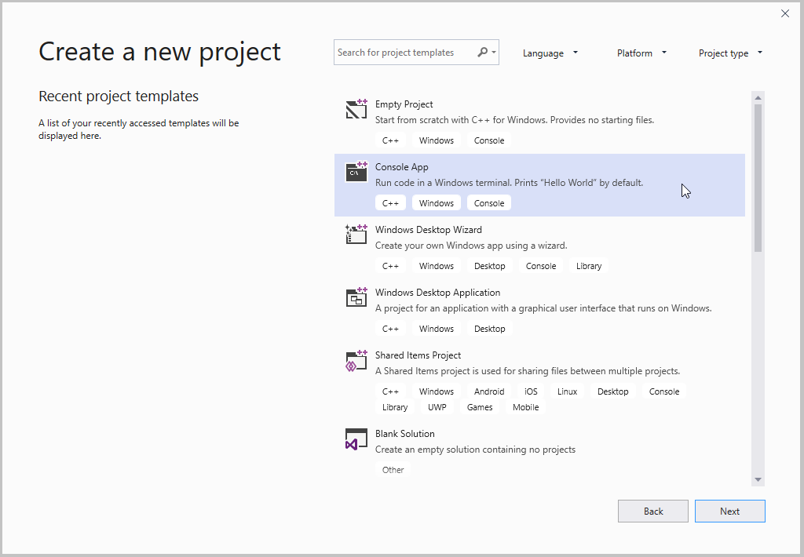

# GitHub Repository Integration Guide

This guide provides instructions on how to properly integrate your `README.md` files and associated images into your GitHub repository for optimal display and accessibility.

## 1. Repository Structure

It is recommended to organize your project files in a clear and logical structure. For this project, a suggested structure would be:

```
Text-Editor/
├── Text-Editor-project/  (Your source code files: main.cpp, editor.cpp, editor.h)
├── .gitignore
├── LICENSE
├── README.md             (Main English README)
├── README_ar.md          (Arabic README - if you wish to keep it)
├── README_QuickStart.md  (Simplified Quick Start Guide)
├── assets/               (Folder for images and diagrams)
│   ├── cover.png
│   ├── data_structure.png
│   ├── data_structure_en.png
│   ├── vs_setup_1.png
│   ├── vs_setup_2.png
│   └── dev_cpp_setup.jpg
└── ...
```

**Explanation:**
*   Place your source code files (`.cpp`, `.h`) in a subfolder (e.g., `Text-editor-project/Text-editor-project/`).
*   Keep the main `README.md` (English version) at the root of your repository. GitHub automatically displays this file on your repository's main page.
*   You can include other language versions (e.g., `README_ar.md`) or specialized READMEs (e.g., `README_QuickStart.md`) at the root as well. Users can navigate to them.
*   Create an `assets/` folder (or `images/`, `docs/images/`, etc.) at the root level to store all your images and diagrams. This keeps your repository clean and organized.

## 2. Uploading Files to GitHub

Use Git commands to add and commit your files, then push them to your GitHub repository.

```bash
git add .
git commit -m "Add READMEs, images, and integration guide"
git push origin main
```

## 3. Linking Images in README Files

When referencing images in your Markdown files, use relative paths that reflect your repository structure. For example, if your `README.md` is at the root and your images are in an `assets/` folder, the links would look like this:

```markdown



```

**Important:**
*   **Relative Paths**: Always use relative paths (e.g., `assets/image.png`) instead of absolute paths (e.g., `/home/ubuntu/project/image.png`) or local file system paths. This ensures the images display correctly on GitHub.
*   **Image Alt Text**: Provide descriptive alt text for each image (e.g., `Project Cover`) for accessibility and in case the image fails to load.

## 4. Updating Existing READMEs

If you have existing `README.md` files that reference images, you will need to update the image paths to reflect the new `assets/` folder structure. For example, change:

``

to

``
---
