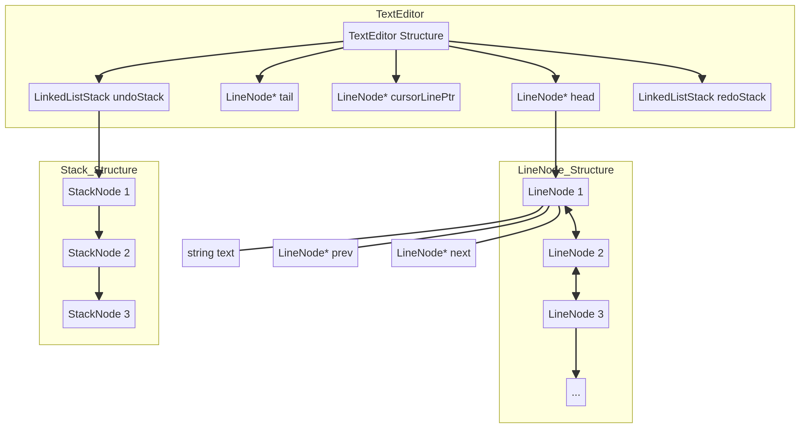

# محرر نصوص بسيط بلغة C++


## نظرة عامة

هذا المشروع عبارة عن محرر نصوص بسيط يعمل من خلال سطر الأوامر (Console-based) تم تطويره باستخدام لغة البرمجة C++. يوفر المحرر وظائف أساسية لتحرير النصوص، مثل الإدراج والحذف والتراجع والإعادة، بالإضافة إلى إمكانية حفظ وتحميل الملفات.

## الميزات

*   **إدراج النصوص**: إمكانية إدراج نصوص في الموضع الحالي للمؤشر.
*   **إدراج سطر جديد**: إضافة سطر جديد في أي مكان داخل النص.
*   **حذف الأحرف والأسطر**: حذف حرف واحد أو سطر كامل.
*   **التنقل بالمؤشر**: تحريك المؤشر داخل النص بسهولة.
*   **التراجع والإعادة (Undo/Redo)**: دعم كامل لعمليات التراجع عن التغييرات وإعادتها.
*   **حفظ وتحميل الملفات**: حفظ المحتوى الحالي للمحرر إلى ملف نصي وتحميل المحتوى من ملف موجود.
*   **البحث والاستبدال**: البحث عن نص معين واستبداله بنص آخر (مع خيار استبدال الكل).
*   **الإحصائيات**: عرض إحصائيات حول النص، مثل عدد الكلمات والأحرف.

## هيكلية البيانات

يعتمد المحرر على هيكلية قائمة مزدوجة الترابط (Doubly Linked List) لتمثيل الأسطر، ويستخدم مكدسين (Stacks) لتطبيق وظائف التراجع والإعادة. يوضح الرسم البياني التالي الهيكل العام للبيانات المستخدمة في المحرر:



## كيفية التشغيل

لتشغيل هذا المشروع، ستحتاج إلى مترجم C++ (مثل g++) وبيئة سطر أوامر.

### المتطلبات الأساسية

*   مترجم C++ (يفضل `g++`).
*   نظام تشغيل يدعم سطر الأوامر (Linux, macOS, Windows).

### التجميع والتشغيل (بيئة التطوير)

1.  **استنساخ المستودع (Clone the repository)**:
    ```bash
    git clone https://github.com/your-username/Text-Editor.git
    cd Text-Editor
    ```

2.  **التجميع (Compile)**:
    استخدم الأمر التالي لتجميع ملفات المصدر:
    ```bash
    g++ main.cpp editor.cpp -o text_editor
    ```
    سيقوم هذا الأمر بإنشاء ملف تنفيذي باسم `text_editor`.

3.  **التشغيل (Run)**:
    بعد التجميع بنجاح، يمكنك تشغيل المحرر باستخدام الأمر:
    ```bash
    ./text_editor
    ```

### التشغيل كبرنامج واحد (Production)

بمجرد تجميع المشروع، يصبح الملف التنفيذي `text_editor` برنامجًا قائمًا بذاته. يمكنك توزيعه وتشغيله مباشرة على أي نظام يتوافق مع بيئة التجميع.

1.  **نقل الملف التنفيذي**: انقل الملف `text_editor` إلى الموقع المطلوب.
2.  **التشغيل**: قم بتشغيل الملف التنفيذي مباشرة:
    ```bash
    /path/to/your/text_editor
    ```

## الاستخدام

عند تشغيل المحرر، ستظهر لك قائمة بالخيارات المتاحة. يمكنك إدخال الأرقام المقابلة للأوامر لتنفيذها. على سبيل المثال:

*   `1`: إدراج نص.
*   `2`: حذف حرف.
*   `16`: حفظ الملف.
*   `18`: الخروج من المحرر.

اتبع التعليمات التي تظهر على الشاشة للتفاعل مع المحرر.

## المساهمة

نرحب بالمساهمات في هذا المشروع. إذا كان لديك أي اقتراحات أو تحسينات، فلا تتردد في فتح مشكلة (issue) أو إرسال طلب سحب (pull request).

---
